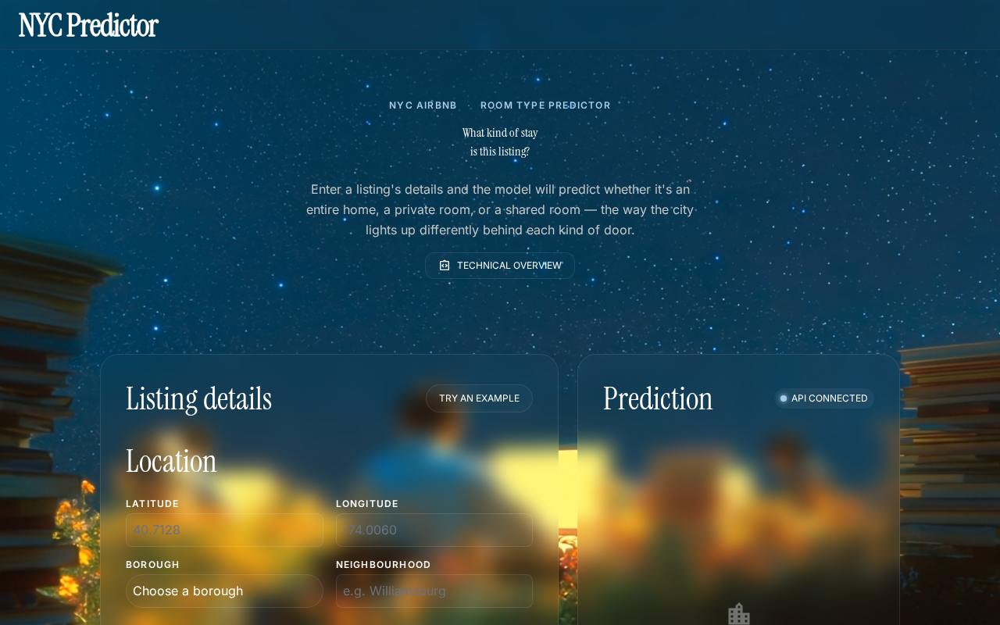
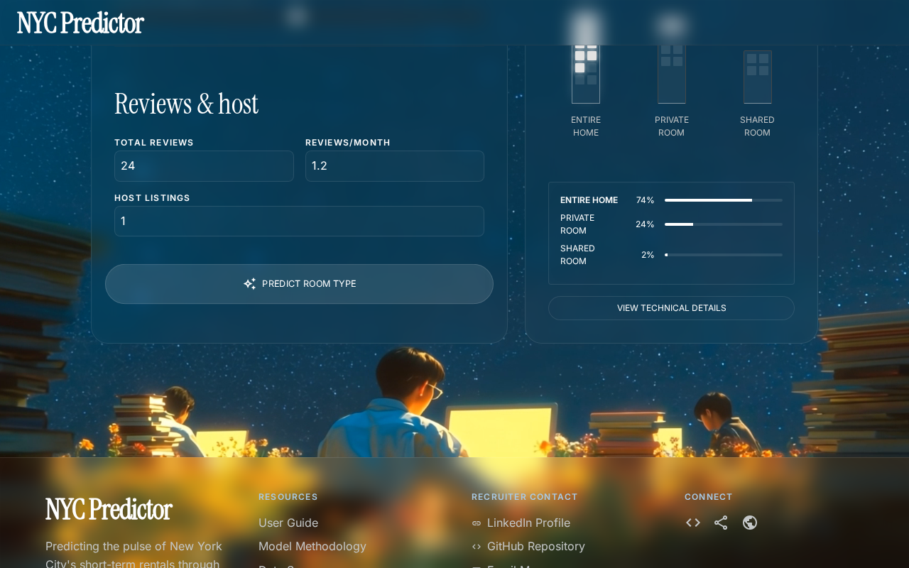
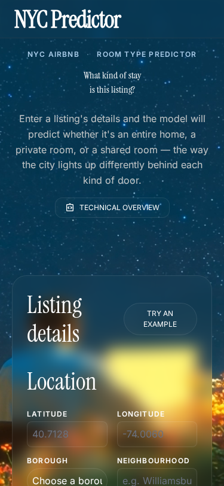
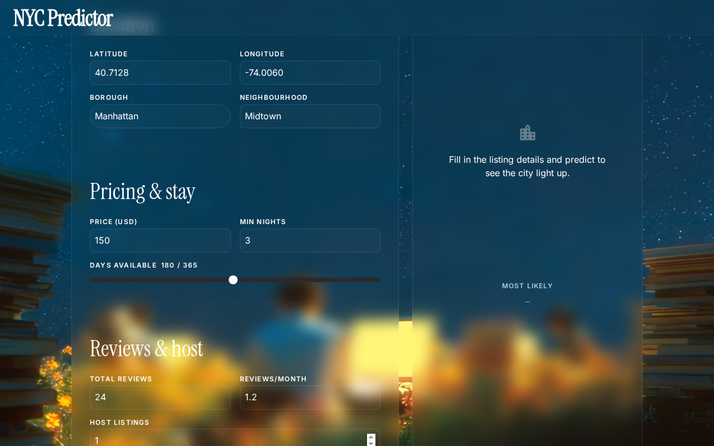
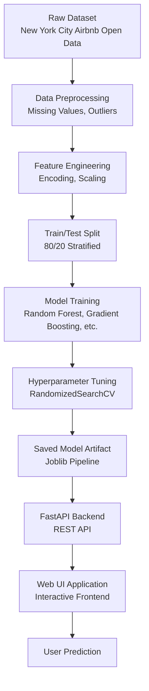

<div align="center">

# 🏙️ NYC Airbnb Room Type Classification

**A full-stack Machine Learning web application that predicts the exact type of an Airbnb room based on its listing attributes.**

[](https://www.python.org/)
[](https://scikit-learn.org/)
[](https://fastapi.tiangolo.com/)
[](https://pandas.pydata.org/)
[](https://nyc-airbnb-room-type-classification.vercel.app/)

**[Live Demo](https://nyc-airbnb-room-type-classification.vercel.app/)** | **[Explore the Dataset](https://www.kaggle.com/datasets/dgomonov/new-york-city-airbnb-open-data)**

</div>

<br>

## 📸 Screenshots

| 🏠 Home View | 📊 Prediction Results |
| :---: | :---: |
|  |  |
| **Mobile View** | **Prediction Form** |
|  |  |

---

## 📖 Table of Contents

- [Project Overview](#-project-overview)
- [Architecture & ML Pipeline](#-architecture--ml-pipeline)
- [Key Features](#-key-features)
- [Tech Stack](#-tech-stack)
- [Model Evaluation](#-model-evaluation)
- [Folder Structure](#-folder-structure)
- [Installation & Local Setup](#-installation--local-setup)
- [Usage](#-usage)
- [Future Improvements](#-future-improvements)

---

## 🚀 Project Overview

The **NYC Airbnb Room Type Classification** project leverages real-world data from the New York City Airbnb Open Dataset. It frames a multi-class classification problem where the goal is to accurately predict the `room_type` of an Airbnb listing given its various characteristics (such as location, price, and review data).

The application offers an interactive front-end connecting to a **FastAPI** backend that exposes a robust and tuned machine learning model.

### 🎯 Objective
To predict whether an Airbnb listing is an **Entire home/apt**, a **Private room**, or a **Shared room** with high accuracy. This can help property owners determine how to list their rooms appropriately and can assist platforms with automated verification checks.

---

## 🧠 Architecture & ML Pipeline

The full machine learning lifecycle from data ingestion to user prediction is handled efficiently:



### ML Pipeline Steps:
1. **Data Preprocessing & Cleaning:** Handling missing values, clipping outliers in price and stay duration.
2. **Feature Engineering:** Using `ColumnTransformer` for robust scaling (StandardScaler) and One-Hot Encoding without data leakage.
3. **Model Selection:** Baselines were established using Logistic Regression, Decision Trees, Random Forest, and Gradient Boosting.
4. **Tuning:** Utilizing `RandomizedSearchCV` optimizing for macro-F1 score to address class imbalances.
5. **Serialization:** Saving the entire inference pipeline (transformers + model) into `Model_Pipeline.pkl`.

---

## ✨ Key Features

- **Interactive UI:** A highly polished, responsive frontend built with modern design principles and tailwind CSS.
- **RESTful ML API:** Serves predictions blazingly fast using a stateless `FastAPI` instance.
- **Data Preprocessing in Pipeline:** The model takes raw input; all scaling and encoding are natively handled inside the serialized scikit-learn pipeline.
- **Real-Time Predictions:** Displays both the predicted class and the corresponding probabilities.
- **Health Checks:** Native `/health` endpoints to monitor the API status.

---

## 🛠️ Tech Stack

| Category | Technologies |
|---|---|
| **Machine Learning** | Scikit-Learn, Pandas, NumPy, Joblib |
| **Backend API** | Python, FastAPI, Pydantic, Uvicorn |
| **Frontend UI** | HTML5, CSS3, JavaScript (Vanilla), Tailwind CSS |
| **Experimentation** | Jupyter Notebooks |
| **Deployment** | Vercel (Frontend & Serverless API), Render (Backend API Support) |

---

## 📊 Model Evaluation

The best performing model (a highly tuned Random Forest/Gradient Boosting algorithm) achieved the following results on the hold-out test set:

- **Accuracy Score:** ~85.6%
- **Macro F1-Score:** ~74.1%

The performance shows excellent capabilities in separating Entire homes and Private rooms, dealing well with the heavily imbalanced Shared room category thanks to hyperparameter tuning for the macro-F1 metric.

---

## 📂 Folder Structure

```
NYC_Airbnb_Room_Type_Classification/
├── docs/                   # Documentation and Screenshots
│   └── screenshots/
├── frontend/               # UI application codebase
│   ├── index.html          # Web application entry point
│   ├── script.js           # Frontend logic and API integration
│   ├── style.css           # Styling and layout
│   └── tailwind.config.js
├── notebooks/              # ML exploration and training
│   └── nyc_airbnb_room_type_classification.ipynb
├── main.py                 # FastAPI application serving the model
├── Model_Pipeline.pkl      # Serialized Scikit-Learn Pipeline
├── requirements.txt        # Python dependencies
└── vercel.json             # Deployment configuration
```

---

## 💻 Installation & Local Setup

Want to run this project locally? Follow these steps:

### 1. Clone the repository
```shell
git clone https://github.com/sumitjadhav1703/NYC_Airbnb_Room_Type_Classification.git
cd NYC_Airbnb_Room_Type_Classification
```

### 2. Set up the Python Backend
Create a virtual environment and install the required dependencies:
```shell
python3 -m venv environment_name
source environment_name/bin/activate  # On Windows: environment_name\Scripts\activate
pip install -r requirements.txt
```

### 3. Run the API Server
Start the FastAPI backend locally on port 8000:
```shell
uvicorn main:app --reload
```
You can verify the backend is running by navigating to `http://localhost:8000/docs` to see the Swagger UI.

### 4. Run the Frontend
Simply open the `frontend/index.html` file in your preferred web browser, or use a tool like Live Server.

*(Note: The frontend is currently configured to ping the cloud API by default. For local testing, update `API_BASE_URL` in `frontend/script.js` to `http://localhost:8000`)*

---

## ⚡ Usage

1. Open the [Live Web App](https://nyc-airbnb-room-type-classification.vercel.app/).
2. Fill out the **Listing Characteristics** (Latitude, Longitude, Price, Minimum Nights, Neighborhood, etc.).
3. Click the **"Predict Room Type"** button.
4. The backend model will instantly run inference and return the predicted room type (`Entire home/apt`, `Private room`, or `Shared room`) along with confidence probabilities!

---

## 🔮 Future Improvements

While this project is fully functional, here are some great future enhancements that could be made:
- **Dockerization:** Containerizing the backend API and frontend for easier cloud deployments.
- **MLflow Tracking:** Utilizing tools like MLflow to track model experiments, parameters, and metrics systematically.
- **Explainable AI (XAI):** Integrating SHAP or LIME to provide users with explanations on *why* a particular room type was predicted.
- **Batch Processing:** Creating an endpoint to handle `.csv` uploads for batch predictions.

---

## 🤝 Contributing

Contributions are always welcome! If you have ideas for improvements:
1. Fork the Project.
2. Create your Feature Branch (`git checkout -b feature/AmazingFeature`).
3. Commit your Changes (`git commit -m 'Add some AmazingFeature'`).
4. Push to the Branch (`git push origin feature/AmazingFeature`).
5. Open a Pull Request.

---

## 📄 License
*This repository does not currently contain a license file, but it is available as open source.*

---
<p align="center">
  Built with ❤️ by Sumit Jadhav
</p>
